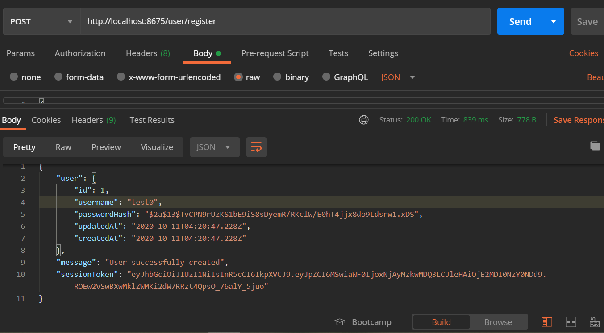

<!-- USER CONTROLLER -->
<!-- POST /user/register -->

<!-- POST /user/login -->

<!-- WORKOUT LOG CONTROLLER -->
<!-- POST /log/ -->

<!-- GET /log/ -->

<!-- GET /log/:id -->

<!-- PUT /log/:id -->

<!-- DELETE /log/:id -->
